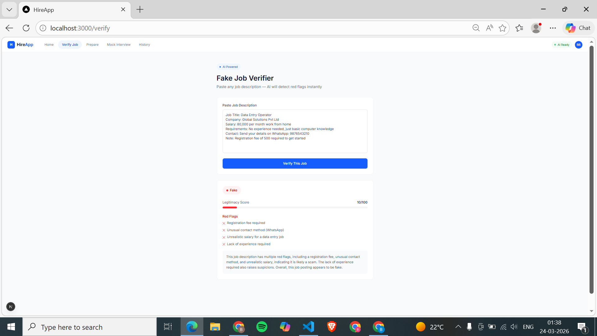

# 🚀 TalentAI Nexus

### 💡 Where Talent Meets Intelligence

---

## 📌 Overview

**TalentAI Nexus** is an AI-powered career platform designed to help students prepare for placements through intelligent tools like mock interviews, fake job detection, and personalized skill insights.

It acts as a centralized ecosystem that enhances job readiness and ensures safer hiring experiences.

---

## 🎯 Key Features

* 🤖 **AI Mock Interviews**
  Practice real interview scenarios with AI-based chatbot interaction.

* 🔍 **Fake Job Detection**
  Identify and avoid fraudulent job postings using smart analysis.

* 📊 **Skill Analysis Dashboard**
  Get insights into strengths and areas of improvement.

* 🧠 **Resume Analyzer** *(optional / future scope)*
  Analyze resumes and get AI-based suggestions.

* 🎯 **Placement Preparation System**
  Structured approach to crack interviews and improve performance.

---

## 🛠️ Tech Stack

* ⚡ **Framework:** Next.js 14
* 🎨 **Styling:** Tailwind CSS
* 🧠 **State Management:** Redux Toolkit
* 🤖 **AI Integration:** Claude AI API
* 🗂️ **Data Handling:** JSON-based company/job dataset
* 💾 **Storage:** localStorage (for user history & sessions)
* 🚀 **Deployment:** Vercel


---

## ⚙️ Installation & Setup

```bash
# Clone the repository
git clone https://github.com/Bhumika955/talentai-nexus.git

# Go to project folder
cd talentai-nexus

# Install dependencies (if using React)
npm install

# Run the project
npm start
```

---

## 📸 Screenshots

* verify fake jobs


---

## 🚀 Future Enhancements

* 🔗 Real-time job API integration
* 🎙️ Voice-based mock interviews
* 📈 Advanced analytics dashboard
* 🤝 Recruiter-student matching system

---

## 👩‍💻 Author

**Bhumika Banke**

---

## 🌟 Contribution

Feel free to fork this repository and contribute!

---

## 📬 Contact

For any queries or suggestions, reach out via GitHub.

---
